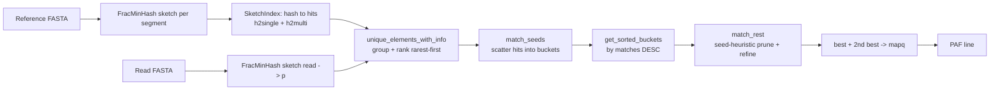

# The Original `shmap` Algorithm

> **Scope of this document.** This describes the **original `shmap`** (a.k.a.
> *Map-SHmap* / `sweepmap`) — the full C++17/20 read mapper that lives in the
> sibling `shmap/` project. It is **not** a description of `minshmap`. `minshmap`
> is the deliberately minimal, educational re-implementation (in the spirit of
> `minSH` vs. a full A* aligner); this file documents the *real* system that
> `minshmap` is distilled from, so the two can be compared component by component.
>
> Source of truth: `shmap/src/` (`map.cpp`, `mapper.{h,cpp}`, `shmap.h`,
> `sketch.h`, `index.h`, `buckets.h`, `types.h`, `io.h`).

---

## 1. High-level summary

`shmap` is a **sketch-based long-read mapper**. Given a reference genome `T` and
a set of query reads `P`, it reports, for each read, the genomic interval it most
likely originates from, in **PAF** format. It is built for noisy long reads
(PacBio HiFi/CLR, ONT) where exact alignment is too slow to use as the primary
search.

Instead of aligning, `shmap` reduces both reference and read to small
**FracMinHash sketches** (subsets of their k-mers) and asks a similarity
question: *which region of the reference shares the most sketch k-mers with this
read?* The answer is found by scattering the read's k-mer hits into overlapping
reference **windows ("buckets")**, ranking those buckets, and then refining only
the most promising ones with a sliding-window similarity metric. Crucially, a
**seed heuristic** — the same idea that powers the `minSH` A* aligner — gives a
cheap, provable **upper bound** on how similar a bucket could *ever* become, so
unpromising candidates are pruned long before any expensive work is done.

### The core ideas behind its performance

1. **Sketch instead of align.** FracMinHash keeps only k-mers whose hash falls
   below a threshold (`h ≤ hFrac·MAX`), shrinking the data by ~`1/hFrac` (e.g.
   20×). All downstream work is on sketches, not sequences. This is the single
   biggest constant-factor win.
2. **Strand-canonical, rolling ntHash.** A k-mer's hash is computed from forward
   and reverse-complement hashes with a single 64-bit rotate per base
   (`std::rotl`/`rotr`). The hash is recomputed in **O(1)** per shifted window
   (rolling), so sketching a sequence is O(n) with a tiny constant. Canonicality
   means a k-mer and its reverse complement collapse to the same key, so reads
   from either strand are found with one index.
3. **Rarest-seed-first ordering.** Read k-mers are ranked by how *few* times they
   occur in the reference (`hits_in_T` ascending). Rare seeds are far more
   informative and far cheaper to follow, so the search spends its budget on
   high-signal anchors and avoids drowning in repeat k-mers.
4. **Bucketing turns "find a region" into hashing.** Reference hit positions are
   bucketed into overlapping fixed-width windows. Locating candidate regions
   becomes O(1)-per-hit bucket increments plus a sort — no chaining, no DP, over
   the whole genome.
5. **Seed-heuristic pruning (the link to `minSH`).** For each bucket, a lower
   bound on "seeds that cannot be matched" yields an **upper bound on achievable
   containment**: `sh = 1 − (seeds − matches)/m`. As soon as `sh < threshold`,
   the bucket is provably hopeless and is discarded without refinement. The
   threshold **ratchets upward** to the best score found so far, so most
   candidates die after touching only a handful of seeds.
6. **Lazy, incremental everything.** Seeds are added to a bucket only until it
   either passes or is pruned; the similarity metric uses an incremental
   difference histogram updated as a window slides. Work is proportional to the
   *informative* signal, not to the genome size.
7. **Cheap, separable refinement.** Only buckets that survive pruning get the
   sliding-window containment metric, and only the best + second-best survive to
   compute a minimap2-style `mapq`. Expensive steps run on a tiny candidate set.

Together these mean `shmap`'s runtime is dominated by sketching + a near-linear
sweep over a small number of informative hits, which is why it is competitive
with (and on some workloads faster than) established mappers while staying
conceptually simple.

### Pipeline at a glance



---

## 2. Component-by-component description

### 2.1 I/O and parameters — `io.h`, `map.cpp`

- `map.cpp` is the entry point: it parses CLI flags into a `params_t`, builds the
  reference index once, then streams reads through the mapper, emitting PAF.
- FASTA/FASTQ parsing uses `klib`'s `kseq`. The reference may contain many
  **segments** (e.g. chromosomes); each becomes a `RefSegment` with its own
  sketch.
- **Default parameters** (`params_t`):
  `k = 15`, `hFrac = 0.05`, `theta = 0.9`, `min_diff = 0.02`,
  `max_overlap = 0.5`, `metric = Containment`, `max_seeds = -1`,
  `max_matches = -1`.
- **CLI flags:** `-p` reads, `-s` reference, `-k` k-mer length, `-r` hFrac,
  `-t` theta, `-d` min_diff, `-o` max_overlap, `-m` metric, `-S` max_seeds,
  `-M` max_matches, `-v` verbose.
- The mapper is templated on three compile-time booleans —
  `SHMapper<no_bucket_pruning, one_sweep, abs_pos>` — so variants are selected
  with zero runtime cost. The default instantiation is
  `SHMapper<false, false, false>`.

### 2.2 The sketch — `FracMinHash` in `sketch.h`

The sketcher converts a sequence into a `sketch_t` = `vector<Kmer>`, where each
`Kmer{ r, h, strand }` stores the k-mer's right-end position `r`, its 64-bit hash
`h`, and a `strand` bit.

- **Hashing (ntHash-style).** Two running hashes are maintained: `h_fw` (forward)
  and `h_rc` (reverse complement). Each base contributes a per-base random 64-bit
  value from a lookup table (`LUT_fw`, `LUT_rc`) rotated by its position:
  ```cpp
  h_fw ^= std::rotl(LUT_fw[s[r]], k-r-1);
  h_rc ^= std::rotl(LUT_rc[s[r]], r);
  ```
- **Rolling update.** When the window shifts by one base the hashes are updated in
  O(1) by rotating the whole hash by one and XOR-ing out the leaving base / XOR-ing
  in the entering base:
  ```cpp
  h_fw = std::rotl(h_fw,1) ^ std::rotl(LUT_fw[s[r-k]],k) ^ LUT_fw[s[r]];
  h_rc = std::rotr(h_rc,1) ^ std::rotr(LUT_rc[s[r-k]],1) ^ std::rotl(LUT_rc[s[r]],k-1);
  ```
- **Canonical hash + strand.** The reported hash is `h = h_fw ^ h_rc` (symmetric
  in the two strands), and `strand = h_fw > h_rc` records which orientation the
  k-mer was seen in. Because `h` is strand-symmetric, a read and its reverse
  complement produce the *same* set of keys; the `strand` bit (compared between
  read and reference hit via `codirection`) is what tells `+` from `−` later.
- **FracMinHash selection.** A k-mer is kept only if `h ≤ hThres`, where
  `hThres = hFrac · 2⁶⁴`. This retains a uniform random ≈`hFrac` fraction of all
  k-mers, deterministically and consistently between reference and reads (the same
  k-mer is kept or dropped in both). Sketch size ≈ `hFrac · n`.

> **Note on the `minshmap` port.** The educational port keeps `min(h_fw, h_rc)`
> as the canonical hash rather than the XOR. The XOR form is GF(2)-linear and, at
> whole-chromosome scale, collapses entropy (distinct keys drop by ~30×). The
> original tolerates this in practice at its default scale, but it is a known
> sharp edge — see the `minshmap` task notes.

### 2.3 The reference index — `SketchIndex` in `index.h`

`build_index` sketches every reference segment and inverts the sketch into a
hash → positions map, split for cache efficiency:

- `h2single : hash → Hit` — k-mers that occur **exactly once** in the reference
  (the common, high-value case; stored inline, no vector).
- `h2multi : hash → vector<Hit>` — k-mers that occur **more than once**, with the
  hit list **sorted by position** so a window query can `lower_bound` into it.
- A `Hit` records `segm_id`, position `r` (and a derived `tpos`), and `strand`.
- `count(h)` returns the number of reference occurrences of a hash (0, 1, or
  `h2multi[h].size()`). This is the `hits_in_T` used to rank read seeds.
- `max_matches` (`-M`) caps how many hits a single hash may keep
  (`h2multi[h].size() < max_matches + 1`). On acrocentric/satellite regions a
  single k-mer can have tens of thousands of hits; capping them prevents a few
  pathological repeats from dominating runtime.
- `erase_frequent_kmers()` optionally removes the most frequent k-mers entirely.

### 2.4 Read-side seed preparation — `unique_elements_with_info`

For each read, after sketching to `p` (with `m = |p|` k-mers):

1. **Group by hash.** `p` is sorted by hash (ties broken by descending position,
   which matters for the LCS metric). Runs of equal hash are collapsed into one
   `Seed`.
2. **Per-seed info.** Each unique `Seed` records:
   - `hits_in_T = tidx.count(h)` — reference frequency,
   - `occs_in_p` (the "strike") — how many times it appears in the read,
   - `pmatches` — its read positions,
   - its index among the unique seeds.
3. **Rank rarest-first.** Unique seeds are sorted by `hits_in_T` ascending. The
   search then consumes the rarest, most informative seeds first.

The number of seeds the search will use is
`S = (1 − theta2)·m + 1`, with `theta2 = theta − min_diff`. The reasoning:
any mapping that reaches similarity `theta` must contain at least one matched
seed among the first `S` rarest seeds, so `S` is a safe budget.
(`more_seeds_if_cheap` may extend `S` to absorb extra seeds that have ≤1 hit, i.e.
that cost essentially nothing.)

### 2.5 Candidate generation — buckets — `buckets.h`, `match_seeds`

The reference is divided into **overlapping windows** called buckets. With
half-length `halflen = m` (the read sketch size; or the read length in `abs_pos`
mode), bucket `b` spans `[b·halflen, (b+2)·halflen)` — i.e. each bucket is two
half-lengths wide and **consecutive buckets overlap by 50%**. A hit at position
`x` is added to **both** bucket `b = x/halflen` and bucket `b−1`, guaranteeing
that any read-sized region falls wholly inside at least one bucket regardless of
alignment offset.

`match_seeds` walks the first `S` rarest seeds and scatters their reference hits:

- A seed with **one** hit (`h2single`) is added directly to its position's
  buckets.
- A seed with **many** hits is first locally bucketed (so the same read k-mer
  occurring twice in one window counts once, capped by `occs_in_p`), then merged
  into the global buckets.

Each `BucketContent` accumulates: `matches` (matched seeds), `seeds` (seeds
considered), `codirection` (net strand agreement), and `r_min`/`r_max` (the
extent of matched positions). `get_sorted_buckets` returns all candidate buckets
sorted by `matches` **descending** — the densest regions are examined first,
which makes the score threshold ratchet up quickly.

### 2.6 Pruning + refinement — the seed heuristic — `match_rest`

This is the heart of the algorithm and the direct analogue of `minSH`'s A* seed
heuristic. For each candidate bucket (densest first):

1. **Seed-heuristic upper bound.** `seed_heuristic_pass` lazily folds in
   remaining seeds while computing
   ```
   sh = hseed(m, seeds, matches) = 1 − (seeds − matches)/m.
   ```
   `sh` is an **upper bound** on the containment this bucket could possibly reach
   (every still-unconsidered seed is optimistically assumed to match). The moment
   `sh < thr`, the bucket cannot beat the current best and is **pruned** with no
   further work. If all seeds are folded in and `sh ≥ thr`, the bucket
   **passes**.
   - *In `minSH`* the same count bounds remaining **edit distance** for A*; *in
     `shmap`* it bounds achievable **containment/similarity** for mapping. Same
     mathematics, different quantity.
2. **Refinement (only on survivors).** `findBestMapping` computes the actual
   score with the chosen `metric`:
   - **Containment** (default): `bestFixedLength` slides a read-sized window over
     the bucket's reference k-mers, maintaining an incremental `diff_hist`
     intersection count, and keeps the offset maximizing
     `intersection / m`.
   - **Jaccard**: `intersection / (m + s − intersection)`, same sliding window.
   - **bucket_SH**: uses `sh` directly as the score (no sliding window).
   - **bucket_LCS**: longest increasing subsequence of matched read positions
     (a co-linearity / chaining proxy), via patience sorting.
3. **Threshold ratchet.** `thr` starts at `theta` and is raised to the best score
   found, so later buckets must clear an ever-higher bar — most are pruned in
   step 1.
4. **Best + second best.** `match_rest` is run once to find `best`, then again
   with a raised threshold `best·(1 − min_diff)` and `best` marked *forbidden*
   (overlap `< max_overlap`) to find a distinct `best2`.

### 2.7 Scoring and output — `Mapping`, `MappingPAF` in `sketch.h`

- **Mapping quality** (`calc_mapq`, minimap2-inspired): from the best and
  second-best scores, `frac = 1 − score2/score`. If `frac > min_diff` the mapping
  is confident → `mapq = 60` (reduced to 5 if strands disagree, i.e.
  `|codirection| < intersection/2`); otherwise `mapq = 0`. A unique, well-separated
  placement gets high quality; an ambiguous one (a near-tie with the runner-up)
  gets zero.
- **Strand** comes from the sign of `same_strand_seeds` (`codirection`): `+` if the
  read and the reference region agree in orientation, `−` otherwise.
- **PAF line** (`MappingPAF`): query name, query length, query start/end, strand,
  reference segment name, segment length, target start/end, residue matches, block
  length, and `mapq`.

### 2.8 Supporting pieces

- **`types.h`** — `Kmer`, `Hit`, `Seed`, `BucketLoc`, `BucketContent`, and the
  position typedefs (`rpos_t`, `qpos_t`, `hash_t`).
- **`handler.h` / `utils.h`** — the `Handler` (shared params + counters) and the
  `Counters`/`Timers` instrumentation used for stats and profiling.
- **`analyse_simulated.h`** — evaluation helpers for simulated reads (ground-truth
  containment/Jaccard, false-discovery tracking).
- **`refine.h`** — currently unused (`#include` commented out in `shmap.h`).
- **Dependencies** (`ext/`, git submodules): `unordered_dense` and `gtl` (fast
  hash maps / vectors), `cmd_line_parser`, `klib` (FASTA/kseq), `edlib`
  (alignment, for evaluation), `tracy` (profiler), `pdqsort`.

---

## 3. Why this is the design `minshmap` shrinks

`minshmap` keeps the load-bearing ideas — FracMinHash sketching, a hash→positions
index, rarest-seed-first ordering, overlapping buckets, and the seed-heuristic
containment prune — and drops the production machinery (templated mapper variants,
Jaccard/LCS metrics, Tracy/timers/counters, the second-best+`mapq` chaining, the
many hash-map specializations). The mapping above lets each `minshmap` component
be traced back to its origin in `shmap/src/`, which is the whole point of the
minimal re-implementation.
